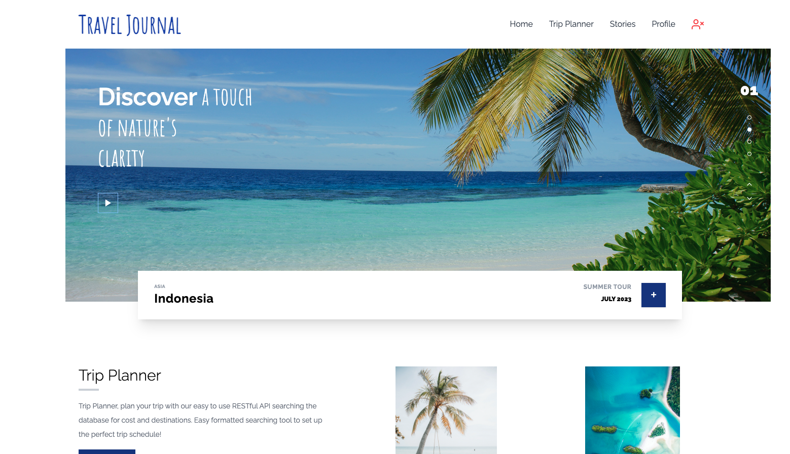
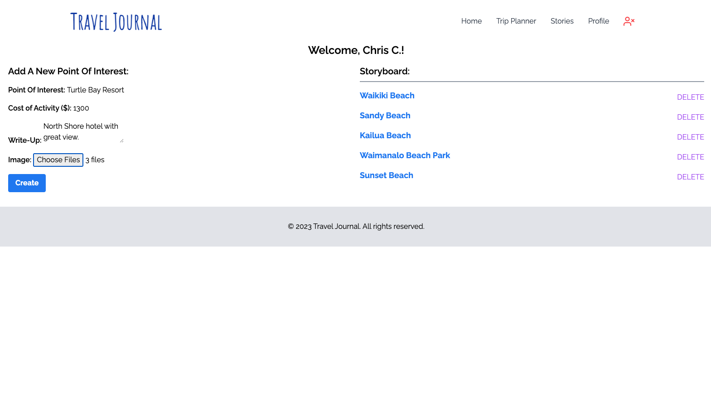
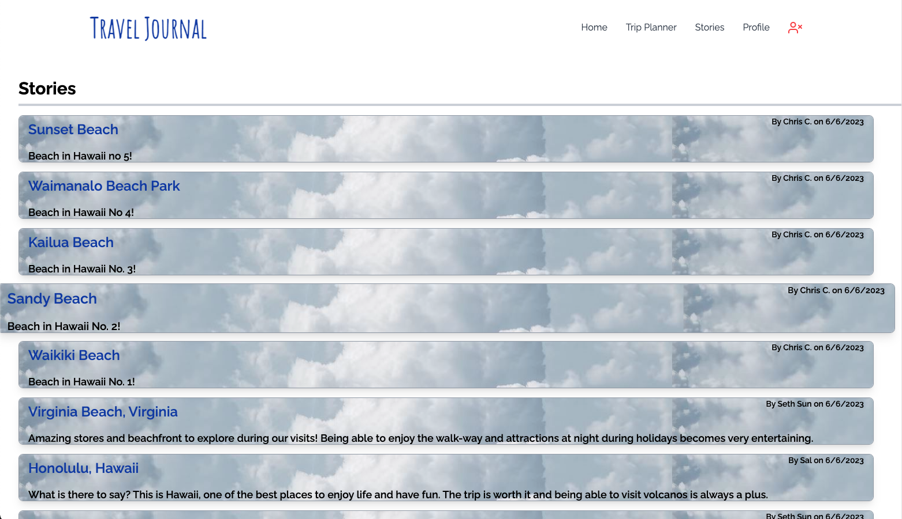
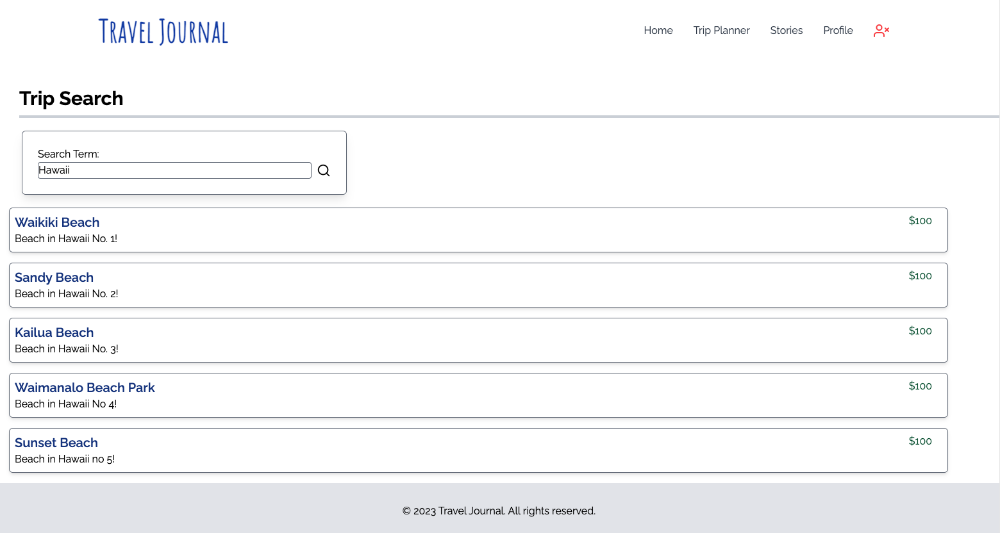

# The Travel Journal

A travel journal app that saves your favorite travel memories. Add points of interest, photos and reviews!

## Description

- This application is designed to organize your points of interest so that you can access all your travel information in one place. Save photos, reviews, memories and even keep track of a travel budget. Users can also get travel ideas by checking out other travelers' stories and adding comments to places they find interesting.
- Help keep your most relevant travel data organized. Find photos, reviews, budgeting, and location data all in one place.
- We often forget to keep track of our travel memories, and when it's time to share them with others, we don't have all the information we need to give a complete picture of the activities we did or the things we saw. This applicaiton keeps track of relevant details in a simple format so you can easily track your budget and share memories. it allows you to create a "story" so that your travel interests can be accessed whenever you want to revist them, share them or plan new trips.
- The developers learned the value of keeping a well-organized data base, data model structure and security features.

## Table Of Contents

- [Installation](#installation)

- [Usage](#usage)

- [Credits](#credits)

- [License](#license)

## Installation

- If you want to run this from the console:
- We use mysql to manage our database, so the user will need to first initiate the database in their system using the command "mysql", followed by "source schema.sql;" to create the database in their system locally.
- Please install all required dependencies to run this from your console: "npm i" >> then "npm start" to initialize the server.

## Usage

- Once the program has been initialized, the user can create a login profile.
- Once logged-in the user can create stories for their points of interest.
- Each story is essentially a journal entry that will take the name of a place or activity, the cost of the activity, a description and optional photos upload.
- The saved story will then be displayed in their profile pannel, and will be visible to all users on the homepage.
- All users can comment on any story.

## Screenshot / Video

## Contributing

This project was built in collaboration with:

- [Sith Sun](https://github.com/SithHun)
- [Allison Tune](https://github.com/amtune)
- [Nina Sandler](https://github.com/antigravityrunner)
- [Chris Chorney](https://github.com/ckc2007)

Third party assets used in this project include:

- [Sequelize](https://www.npmjs.com/package/sequelize)
- [Multer](https://www.npmjs.com/package/multer)
- [Tailwind CSS](https://tailwindcss.com/)
- [Glide.js](https://glidejs.com/)
- [Feather Icons](https://feathericons.com/)
- [Google Fonts](https://fonts.google.com/)

Tutorials used in this project include:

- ["Image / File Upload On Node Sequelize...Multer" by Great Adib](https://www.google.com/search?sxsrf=APwXEdd_5NYqHYZJ0dpjiUC_PNZlgV1P7A:1685826967600[…]rnsgqj_AhXsFFkFHZnnD9sQBSgAegQIExAB&biw=1810&bih=1006&dpr=0.9)

## License

This project is licensed under the MIT license.

## Tests

none at this time

## Questions

Please direct questions to the owner of this repository at ckc2007@gmail.com

Owner GitHub page:
[ckc2007](https://github.com/ckc2007)

## Credits

This README was created using the README generator app by ckc2007!
visit the GitHub page to try it out:
[README Generator app by ckc2007](https://github.com/ckc2007/README-Generator)
